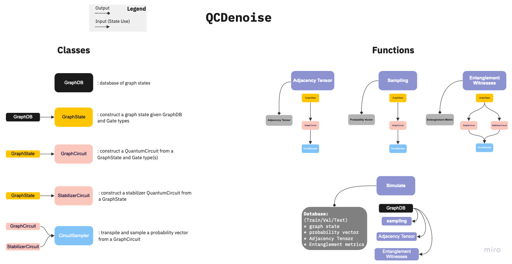

## ``qcdenoise``

(Classical) Machine Learning-based error mitigation of quantum circuits based on highly entangled Graph states
# Table of Contents
- [Table of Contents](#table-of-contents)
    - [Description](#description)
    - [Installation](#installation)
      - [Major Dependencies](#major-dependencies)
    - [Usage](#usage)
    - [Development](#development)
      - [structure](#structure)
      - [testing](#testing)
    - [Authors](#authors)

### Description
```
TBD
```

### Installation 
To install `qcdenoise`:
```
pip install git+https://github.com/nlaanait/qcdenoise.git
```
#### Major Dependencies
1. `qiskit`
2. `pytorch`
3. `networkx`

### Usage
See `examples`

### Development
#### structure 
Below is a high-level structure of the package


#### testing
We use `pytest` to test the package.
To run all tests
```bash
pytest tests
```
### Authors
* Numan Laanait- [@nlaanait](https://github.com/nlaanait)
* Kathleen Hamilton- [@k8hamilton](https://github.com/k8hamilton)

